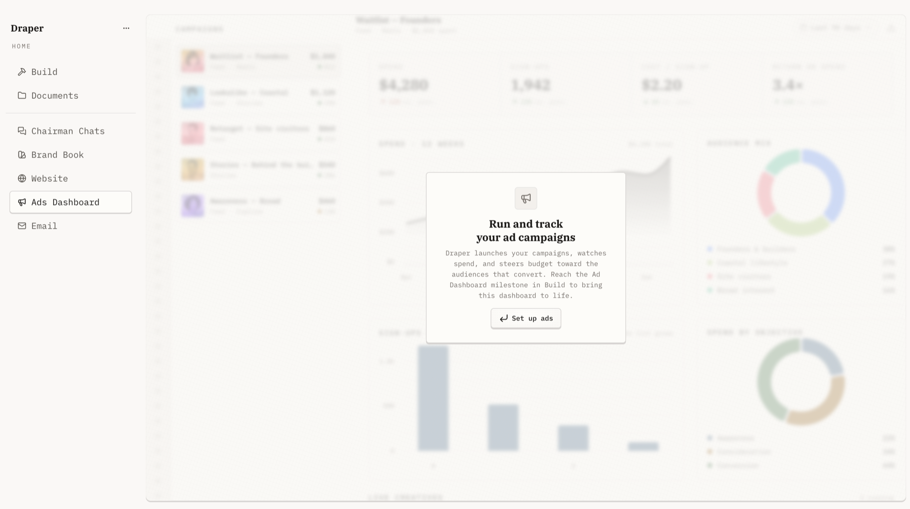
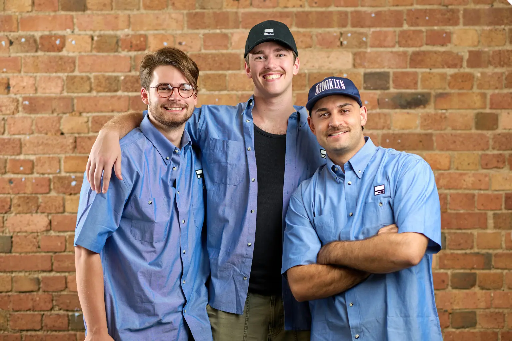

# Draper

### Turn your idea into a real product.

Draper does the work of building your business — designed so one person can operate like ten.

[**Get started, free →**](https://app.draper.chat/auth/google) &nbsp;·&nbsp; [Website](https://draper.chat) &nbsp;·&nbsp; [Pricing](https://draper.chat/pricing) &nbsp;·&nbsp; [Blog](https://draper.chat/blog) &nbsp;·&nbsp; [Guides](https://draper.chat/guides)

 

Built in Sydney, Australia 🇦🇺 &nbsp;·&nbsp; Backed by 

---

## What is Draper?

Draper guides you from a rough idea to a real, tested product — validating the idea, building the brand and product foundation, and finding your first customers. It's built for people juggling a full-time job while getting a venture off the ground, so you can move like a team of ten on your own.

> **Our mission:** three people expanding economic independence by making it easier to build a business than to get a job.

## How it works

Draper works sequentially through three stages, doing the heavy lifting at each step:

| Stage | What Draper does |
| :-- | :-- |
| **1 · Test the idea** | Validates your assumptions with research across Reddit, social media, and competitor analysis. |
| **2 · Build the foundation** | Creates your business name, branding, and product direction — then ships a live landing page. |
| **3 · Find customers** | Runs targeted ads to gather your first sign-ups and build a mailing list. |

 
Draper's Ads Dashboard, one of the milestones on the path.

## What you walk away with

- A tested idea backed by real research
- A business name, brand, and product direction
- A live landing page
- Running ad campaigns and a growing mailing list
- Your first customer sign-ups

## Who it's for

- You don't need a business idea to start.
- It works alongside a full-time job.
- It's built for product businesses — apps, physical goods, and websites.
- Your ideas stay confidential.

## Pricing

**$29/month** — first two workshops free, and a free trial to get started.

[**Start free →**](https://app.draper.chat/auth/google)

## The founders

| | Founder | Role |
| :-- | :-- | :-- |
| 🛠️ | [**Oliver Bagin**](https://www.linkedin.com/in/oliver-bagin/) | Technical Lead |
| 🎨 | [**Dexter Todd**](https://www.linkedin.com/in/dexter-todd-77a600242/) | Product Lead |
| 🤝 | [**Benny Abbatangelo**](https://www.linkedin.com/in/bjabbatangelo/) | Sales Lead |

## Links

- 🌐 **Website** — [draper.chat](https://draper.chat)
- 🚀 **App** — [app.draper.chat](https://app.draper.chat/auth/google)
- 📖 **Blog** — [draper.chat/blog](https://draper.chat/blog)
- 📚 **Guides** — [draper.chat/guides](https://draper.chat/guides)
- 💬 **Support** — [support@draper.chat](mailto:support@draper.chat)
- 🔒 **Privacy** — [draper.chat/privacy](https://draper.chat/privacy) &nbsp;·&nbsp; **Terms** — [draper.chat/terms](https://draper.chat/terms)

 
© Draper · Built in Sydney, Australia

